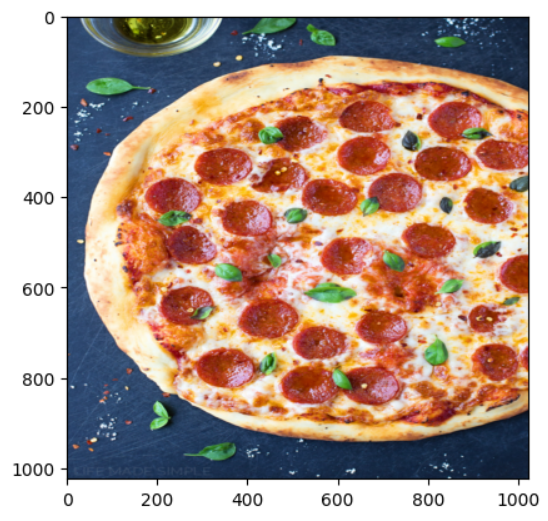
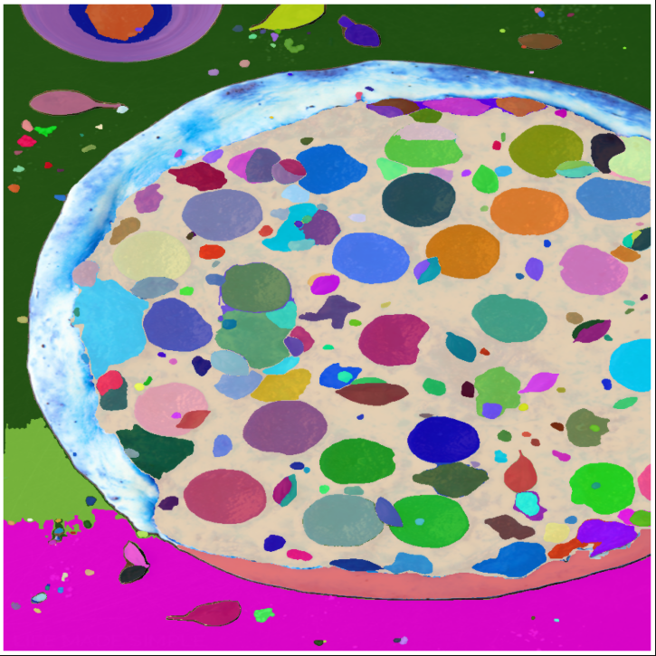
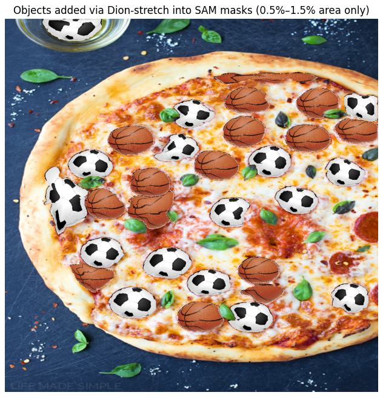

# SegmentCraft

**Authors:** Beloslava Malakova (Eindhoven University of Technology), Boris Gachevski (ETH Zurich), Nea Metohu (Epoka University), Dion Aliu (University of York)

---

## Overview

**SegmentCraft** is a project that explores **image segmentation and object manipulation**.
We use [Meta’s Segment Anything Model (SAM)](https://ai.meta.com/datasets/segment-anything/) to automatically generate segmentation masks, save them, and then manipulate or replace the segmented objects according to **custom thresholds** (e.g., object size). We have also taken inspiration from [Kaggle Pepperoni Mask Notebook](https://www.kaggle.com/code/yogendrayatnalkar/sam-automatic-semantic-segmentation/notebook).

The repository also contains our **initial experiments with K-Means clustering** for image decomposition, which laid the groundwork for the SAM pipeline.

---

## Features

* **Automatic segmentation with SAM**

  * Generate masks for any input image.
  * Store each mask with metadata (area, bounding box, stability score, etc.).

* **Object replacement**

  * Replace selected masks with user-uploaded objects (e.g., icons, balls).
  * Replacement is controlled by thresholds, such as:

    * *Replace only masks larger than 5% of the image area*
    * *Replace masks smaller than 1% of the image area*
    * *Replace masks in a percentile band (e.g., between the 60th and 90th percentile of mask area)*
    * *Scale through Dion-scaling so that the new images fit perfectly in each mask.*

    <p align="center">
       
    </p>

    <p align="center">
       
    </p>
    
    <p align="center">
       
    </p>


* **Round-robin replacement**

  * If multiple replacement images are uploaded, the code distributes them evenly across eligible masks.

* **Background transparency**

  * Uploaded replacement objects are automatically processed to remove their background, so only the object is added.

* **Legacy K-Means clustering pipeline**

  * Before adopting SAM, we experimented with **color clustering via K-Means**. We used k=5.
  * This approach decomposed images into clusters of similar color regions, which could then be cut out and compared to external object datasets (e.g., Columbia’s COIL-100).
  * These scripts are still in the repo for reference.

---

## Example Usage

### 1. Generate masks with SAM

In the notebook, you can load an image and run SAM:

```python
masks = mask_generator.generate(img_rgb)
mask_data = sam_masks_to_dict(masks)
```

Each mask has metadata like:

```python
{
  "area": 1347,
  "bbox": [415, 470, 48, 43],
  "predicted_iou": 0.88,
  "stability_score": 0.94,
  "segmentation": <numpy array>
}
```

### 2. Replace masks based on thresholds

For example, replace only **masks between 0.5% and 1.5% of the total image area**:

```python
out_rgb = replace_area_fraction_with_tiles(
    img_rgb=img_rgb,
    mask_data=mask_data,
    tiles_rgba=tiles_rgba,
    lower=0.005,   # 0.5%
    upper=0.015    # 1.5%
)
```

This produces a new image with selected masks replaced by the uploaded objects.

---

## Getting Started

1. Clone the repository:

   ```bash
   git clone https://github.com/beloslavamalakova/eaf-segment.git
   ```


2. Open the SAM notebook:

   ```bash
   jupyter notebook am_automatic_semantic_segmentation (1).ipynb
   ```

4. Run the cells to generate masks, save metadata, and experiment with object replacement.

---
